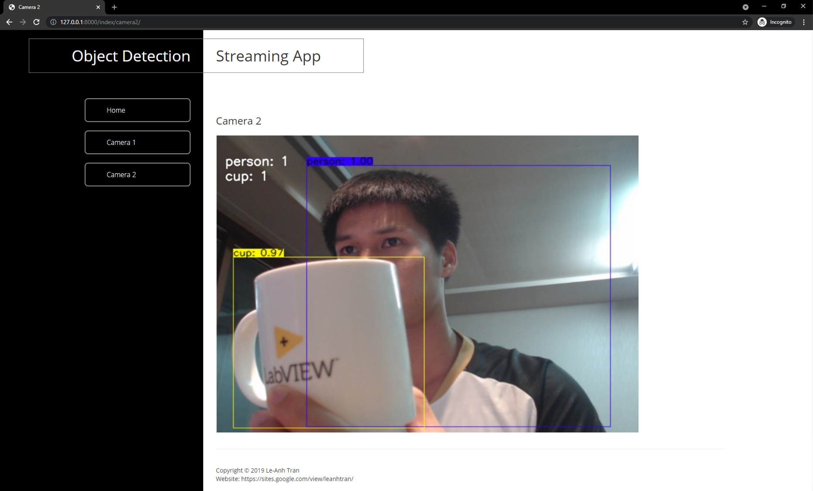

# yolov3-django-streaming

This project is to stream object detection (yolov3) with 2 cameras (2 switchable channels) on web browser using Django framework.

The project can be deployed on Ubuntu and Windows.

Watch final result: https://www.youtube.com/watch?v=SDnpNd7xRbE&t=10s

## 1. Steps to use
1. Download file "yolov3_coco.pb" from the link below and locate it in folder "yolov3_weight": ([gotolink](https://drive.google.com/drive/u/1/folders/1apB-yPIxxzC9D6_iAaQrXWuGpbWIK6Lp))
```bashrc
https://drive.google.com/drive/u/1/folders/1apB-yPIxxzC9D6_iAaQrXWuGpbWIK6Lp
```
2. Create your virtual environment and install required packages: 
```bashrc
$ pip install -r requirements.txt
```
3. Run program: 
```bashrc
$ python manage.py runserver
```
4. Open any web browser and navigate to URL (home page): 
```bashrc
http://127.0.0.1:8000/index
```
## 2. What should happen then?
(don't worry, my face will not be on your screen)
- Camera 1:


- Camera 2:



## 3. Be careful
- The 2 camera ids in the source code are "0" and "2" (for my computer). 
- You should change them for running on any other computers. Go to webcam/views.py then find and change "cam_id" parameter.


## Acknowledgement
- The yolov3 implementation was borrowed from [YunYang1994](https://github.com/YunYang1994/tensorflow-yolov3) 


## Cite This Project
```bashrc
@article{tran2020yolostream,
  title={Object Detection Streaming and Data Management on Web Browser},
  author={Tran, Le-Anh},
  journal={Technical Report},
  year={2020}
}
```

Good luck.

Created on July 11, 2019.

Last update on July 22, 2021. (because I had received tons of emails for fixing this project, thanks)

Tran Le Anh ([LA Tran](https://sites.google.com/view/leanhtran/))

